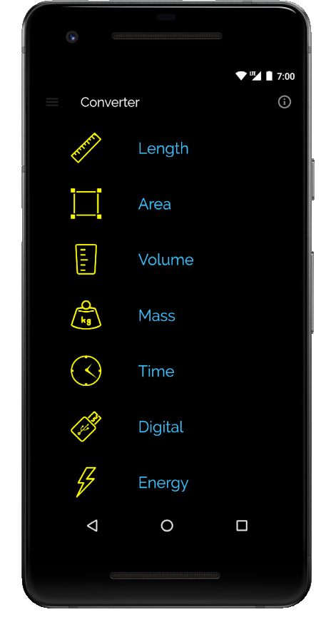
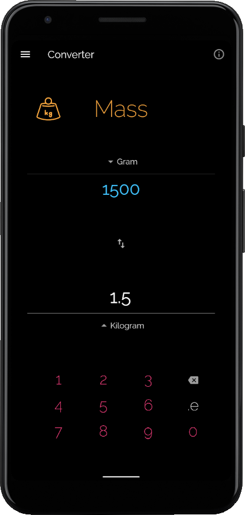
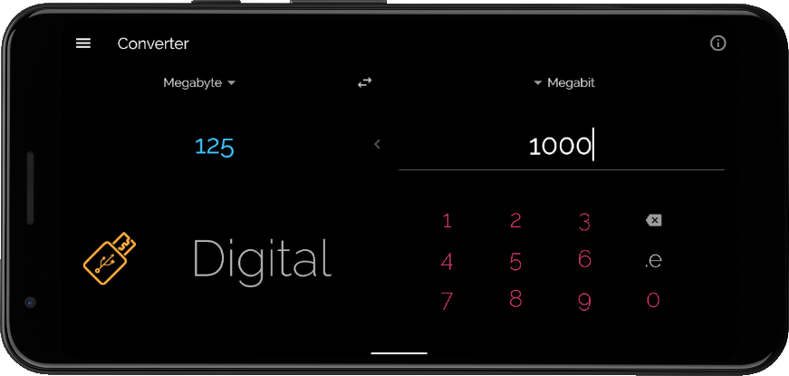
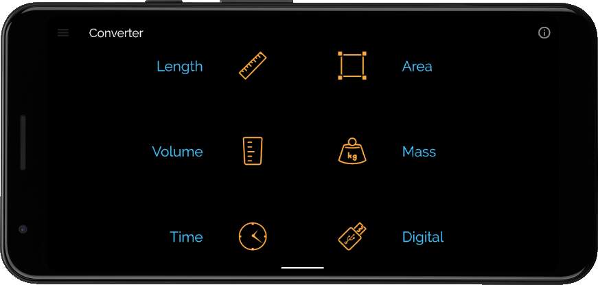

# Converter

Converter is a unit converter app created with Flutter

Made by taking Udacity course [Build Native Mobile Apps with Flutter](https://www.udacity.com/course/ud905).

Android [play.google.com/store/apps/details?id=maxeem.america.flutter.converter](https://play.google.com/store/apps/details?id=maxeem.america.flutter.converter)

iOS [apps.apple.com/us/app/flutter-converter/id1571581474](https://apps.apple.com/us/app/flutter-converter/id1571581474)

 

 

© Max Shemetov, 2021
